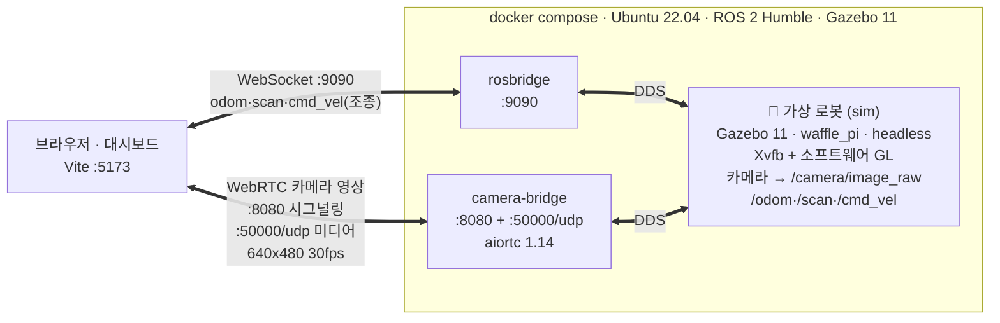
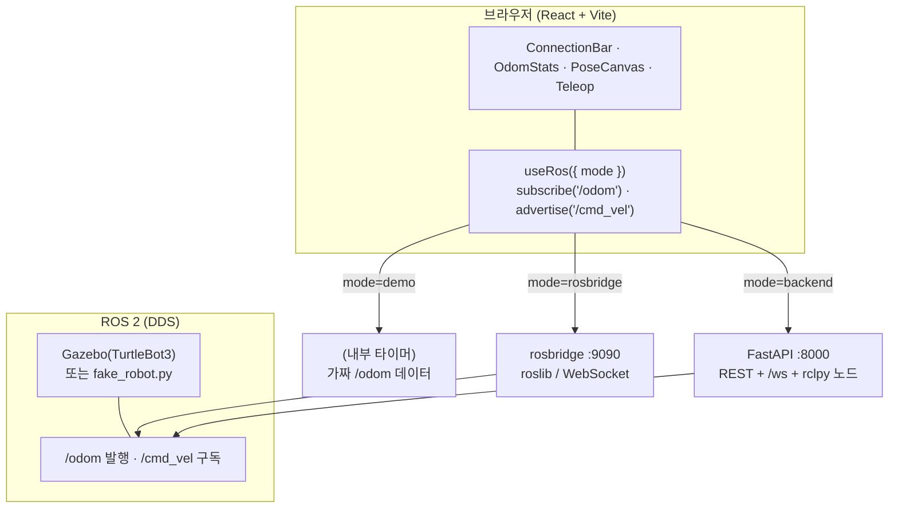
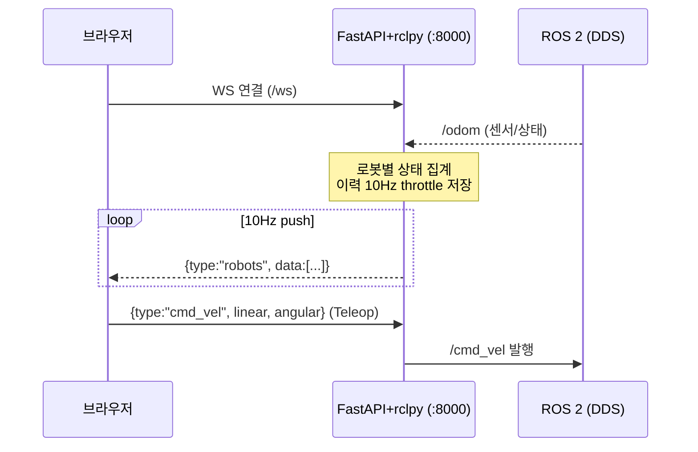

# 프로젝트 구조 (Architecture)

ROS 연동 실시간 웹 대시보드. 로봇 상태(위치·속도·방향)를 브라우저에서 **모니터링**하고,
원격으로 **제어(Teleop)** 한다. 데이터 소스를 3가지 모드로 갈아끼울 수 있는 것이 핵심 설계다.

---

## 1. 전체 시스템 구조 (Docker · 포트 · 통신)

배포 기준 전체 그림. **Gazebo 가상 로봇**(실물 불필요)을 Docker 로 띄우고, 카메라는 WebRTC,
텔레메트리·제어는 rosbridge 로 브라우저에 연결한다. 세 컨테이너가 같은 ROS 2 Humble·같은 DDS 네트워크.



> 대시보드는 `npm run dev`(Vite **:5173**)로 호스트에서 서빙. 위 4개 연결(브라우저→2 브리지, sim→2 브리지) 외 외부 포트는 없다.

**환경/버전** — 호스트 **Windows 11**(Docker Desktop · WSL2 백엔드) 또는 Linux · **Docker 28.1** ·
컨테이너 `ros:humble-ros-base`(**Ubuntu 22.04**) · **ROS 2 Humble**(Fast DDS) · **Gazebo 11**(TurtleBot3 `waffle_pi`) ·
카메라 **aiortc 1.14**(VP8, PyAV 16) · **rosbridge_suite** · 프론트 **React 18 · Vite 5 · roslib 1.4**

- **카메라**: `sensor_msgs/Image` 를 JSON 으로 나르면 대역폭·지연 폭증 → aiortc 브리지가 **WebRTC** 로 직접 스트리밍. 상세·Windows Docker 뚫기는 **§7**.
- **텔레메트리·제어**: 작고 구조화된 데이터라 rosbridge(WebSocket+JSON)가 적합. **왜 aiortc·Humble**: §7 / DEVLOG D-010.

<small>

**🤖 가상 로봇(sim) 참고**
- **Gazebo 11 · waffle_pi · headless**: 모니터 없이 도는 3D 시뮬(waffle_pi = 카메라 장착 TurtleBot3).
- **Xvfb + 소프트웨어 GL**: 화면·GPU 없는 컨테이너에서 카메라 렌더용 가짜 화면(Xvfb)+CPU 렌더(llvmpipe). *(회색 문제→§7.2 sun 해결)*
- **가상카메라 → `/camera/image_raw`**: 영상 발행 → camera-bridge 구독 → WebRTC.
- **`/odom`·`/scan`·`/cmd_vel`**: 위치·라이다 발행, 이동명령 구독(Teleop 버튼).

</small>

---

## 2. 대시보드 데이터 흐름 (프론트 관점 — 3모드 추상화)

아래는 **프론트엔드 관점**의 데이터 소스 추상화다(위 전체 구조 중 브라우저↔데이터소스 부분).
컴포넌트는 소스가 demo/rosbridge/backend 무엇이든 같은 인터페이스로 쓴다.



**핵심 아이디어**: 컴포넌트는 `subscribe(topic)` / `advertise(topic)` 만 호출한다.
데이터가 가짜(demo)든, rosbridge 직결이든, 백엔드 경유든 컴포넌트 코드는 그대로다 —
`useRos` 훅이 모드별 차이를 흡수한다.

> 위 그림은 **텔레메트리(odom/scan/cmd_vel)** 흐름이다. **카메라 영상**은 대역폭 문제로
> rosbridge 가 아니라 별도 **WebRTC 경로**(camera-bridge)를 타며, 구조는 **§7** 에 있다.

---

## 3. 세 가지 동작 모드

| 모드 | 경로 | 용도 | 실행 |
|------|------|------|------|
| **demo** | 브라우저 내부 타이머가 /odom 가짜 데이터 생성 | ROS 없이 UI 개발·스크린샷 | `npm run dev` (기본값) |
| **rosbridge** | 브라우저 ↔ rosbridge(:9090) 직결 (roslib) | 가장 단순한 실연동 | `docker compose --profile direct up` 또는 WSL Gazebo |
| **backend** | 브라우저 ↔ FastAPI+rclpy(:8000) ↔ ROS | 풀스택 운영 계층 시연 | `docker compose --profile platform up` |

> 설계 의도: 대시보드가 "UI만"이 아니라 **운영 소프트웨어 계층(백엔드 브릿지)** 을 포함함을 보이려고
> backend 모드를 별도로 둔다. 백엔드가 throttle·이력·다중로봇 집계 같은 서버 책임을 진다.

> **카메라는 이 3모드와 직교(orthogonal)한다.** 위 모드는 텔레메트리(odom/scan/cmd_vel) 전송 방식이고,
> 카메라 영상은 rosbridge 가 아니라 **별도 WebRTC 경로**(camera-bridge:8080)로 흐른다(§7).
> `CameraView` 는 demo 모드면 웹캠, rosbridge/backend 모드면 WebRTC 브리지에 붙는다.

### backend 모드 시퀀스 (풀스택 운영 계층)



---

## 4. 디렉터리 / 파일 맵

```
ros-web-dashboard/
├── index.html                  Vite 엔트리
├── vite.config.js
├── package.json                react + roslib, scripts: dev/build/preview
│
├── src/                        ── 프론트엔드 (React) ──
│   ├── main.jsx                React 마운트
│   ├── App.jsx                 모드 상태 + 레이아웃(좌: 상태/궤적, 우: 조작)
│   ├── styles.css
│   ├── ros/
│   │   ├── useRos.js           ★ 핵심 훅. 3모드를 같은 인터페이스로 노출
│   │   │                          (status / subscribe / advertise), 자동 재연결
│   │   ├── topics.js           토픽 단일 정의(/odom /cmd_vel /scan /camera).
│   │   │                          ROS1↔ROS2 전환은 여기 messageType 표기만 수정
│   │   └── webrtcRos.js        카메라 WebRTC 브리지 클라이언트(offer→ICE완료→answer→ontrack)
│   └── components/
│       ├── ConnectionBar.jsx   연결상태 표시 + 모드 토글
│       ├── OdomStats.jsx       /odom 수치 카드(x,y,속도 등)
│       ├── StatCard.jsx        수치 카드 표시용 프리미티브
│       ├── PoseCanvas.jsx      /odom 궤적 + heading(방향) 화살표 그리기
│       ├── Teleop.jsx          /cmd_vel 발행(전/후/좌/우 조작)
│       └── CameraView.jsx      카메라 패널(demo=웹캠 / rosbridge·backend=WebRTC 브리지)
│
├── backend/                    ── 풀스택 백엔드 (platform 모드) ──
│   ├── main.py                 FastAPI + rclpy. /odom 구독→집계, REST + /ws(10Hz push),
│   │                              cmd_vel 수신→발행. throttle로 이력 10Hz 저장
│   ├── fake_robot.py           테스트용 로봇(/odom 발행·/cmd_vel 구독)
│   ├── Dockerfile
│   └── entrypoint.sh
│
├── docker/                     ── rosbridge 컨테이너 (direct 모드) ──
│   ├── Dockerfile              rosbridge_server
│   ├── entrypoint.sh
│   └── fake_robot.py
│
├── camera-bridge/              ── 카메라 WebRTC (aiortc) ── ※ §7 참고
│   ├── bridge.py               /camera/image_raw 구독 → WebRTC 스트리밍, WS 시그널링(/webrtc)
│   ├── Dockerfile              ros:humble + aiortc 브리지 이미지
│   ├── requirements.txt        aiortc / aiohttp / av / numpy
│   ├── sim.Dockerfile          Gazebo waffle_pi 헤드리스 시뮬 이미지
│   └── sim-entrypoint.sh       Xvfb 직접 기동 후 launch exec (xvfb-run PID1 멈춤 회피)
│
├── docker-compose.yml          profile 2개: direct(rosbridge:9090) / platform(backend:8000)
├── docker-compose.camera.yml   카메라 스택: sim(Gazebo) + camera-bridge(:8080)
│
├── scripts/                    ── WSL2 실 Gazebo 연동 ──
│   ├── wsl-setup-ros.sh        (1회) ROS2 Humble+Gazebo+TurtleBot3+rosbridge 설치
│   ├── wsl-run-sim.sh          Gazebo 시뮬 실행 (GUI via WSLg)
│   └── wsl-run-rosbridge.sh    rosbridge 실행(:9090)
│
├── README.md
├── DEVLOG.md                   학습노트 + 설계결정(D-001~) + 질문/학습 여정
└── ARCHITECTURE.md             (이 문서)
```

---

## 5. 핵심 컴포넌트 상세

### `src/ros/useRos.js` — 데이터 소스 추상화 훅
- 반환: `{ status, subscribe, advertise }`
- **demo**: 내부 `setInterval`(100ms)로 위치·방향 적분 → 실제와 같은 궤적 형태의 가짜 /odom
- **rosbridge**: `ROSLIB.Ros` 인스턴스로 :9090 직결, `ROSLIB.Topic` 으로 subscribe/publish
- **backend**: `WebSocket(:8000/ws)` 로 상태 수신, cmd_vel 은 JSON 으로 전송
- 공통: `close`/`error` 시 2초 후 자동 재연결
- 메시지 정규화: 어느 모드든 `odomShape()` 로 /odom 표준 형태(쿼터니언 yaw 포함)로 맞춰 컴포넌트에 전달

### `backend/main.py` — 운영 백엔드
- `BridgeNode`(rclpy): `/odom` 구독 → `robots` dict 에 로봇별 상태 집계, `/cmd_vel` 발행
- ROS 노드는 **별도 스레드**에서 `rclpy.spin` (uvicorn 이벤트루프와 분리)
- throttle: 이력은 10Hz(`deque(maxlen=600)` ≈ 60초)만 저장 → 브라우저 부담 완화
- REST: `GET /api/robots`, `GET /api/robots/{id}/history`
- WS `/ws`: 10Hz 상태 push + 대시보드 명령 수신 → `/cmd_vel` 발행

### `src/ros/topics.js` — 토픽 단일 소스
- `/odom`(Odometry) · `/cmd_vel`(Twist) · `/scan`(LaserScan)
- 기본은 ROS 2 표기(`nav_msgs/msg/Odometry`). ROS 1 이면 `/msg/` 를 빼면 됨

---

## 6. 실행 요약

```bash
# 프론트 개발서버 (기본 demo 모드)
npm install
npm run dev                                   # http://localhost:5173

# direct 모드 백엔드 (rosbridge + fake_robot)
docker compose --profile direct up --build    # :9090 → 대시보드에서 rosbridge 모드 선택

# platform 모드 백엔드 (FastAPI 브릿지 + fake_robot)
docker compose --profile platform up --build  # :8000 → 대시보드에서 backend 모드 선택

# 실제 Gazebo 로봇 (WSL2, 설치는 1회)
bash scripts/wsl-run-sim.sh                    # Gazebo + TurtleBot3
bash scripts/wsl-run-rosbridge.sh              # :9090 → 대시보드 rosbridge 모드

# 카메라(WebRTC) + 조종/텔레메트리 스택 — Docker (§7). Windows Docker Desktop 에서 브라우저 실영상 검증됨.
docker compose -f docker-compose.camera.yml up --build   # sim(Gazebo)+rosbridge(:9090)+camera-bridge(:8080)
npm run dev   # → 'rosbridge 직결' 모드 → 카메라 영상 + 위치/속도 + 버튼 조종
```

---

## 7. 카메라(WebRTC) 상세 + Windows Docker 뚫기

카메라 영상만 **다른 전송 경로**를 쓴다. 텔레메트리(odom/scan/cmd_vel)는 rosbridge(WebSocket+JSON),
카메라(`/camera/image_raw`, `sensor_msgs/Image`)는 **WebRTC**. 이미지를 JSON 으로 나르면 대역폭·지연이
폭증하므로(D-010), aiortc 브리지가 카메라만 WebRTC 로 브라우저에 직접 스트리밍한다.

> WebRTC 구현체는 `webrtc_ros`(RobotWebTools) 대신 **aiortc(순수 파이썬)** 를 쓴다.
> webrtc_ros ROS2 브랜치가 3년 넘게 방치·미완성이고 크로미움 libwebrtc 소스 빌드가 필요해서다(D-010).

### 7.1 카메라 경로 상세

전체 그림은 **§1** 참조. 카메라만 보면:
- **시그널링**: 브라우저 ↔ camera-bridge `:8080/webrtc` (WebSocket). SDP offer/answer 를 non-trickle 로 교환.
- **미디어**: 그 뒤 **WebRTC(UDP :50000)** 로 영상 스트림. `CameraView` + `webrtcRos.js` ↔ `bridge.py`.
- **소스**: sim(Gazebo)이 `/camera/image_raw`(rgb8 640x480 30fps) 발행 → bridge 가 구독 → VP8 인코딩 → 전송.
- **코드 흐름**: `bridge.py` 의 `CameraTrack.recv()` 가 최신 ROS 프레임을 `VideoFrame` 으로 aiortc 에 넘김.

### 7.2 Windows Docker Desktop 에서 WebRTC 미디어 뚫기 (해결)

컨테이너→브라우저 WebRTC 미디어(UDP)가 Windows 에서 안 닿던 문제를, **추측 아닌 실측**으로 3가지 원인을 잡아 해결했다(DEVLOG D-010 부록2).

| # | 원인 | 해결 |
|---|------|------|
| 1 | aiortc 가 **랜덤 UDP 포트** 사용 → 퍼블리시 불가 | `WEBRTC_UDP_PORT=50000` 고정 + compose `50000:50000/udp` 퍼블리시 |
| 2 | **컨테이너 특정 IP(172.x)에 바인딩** → docker-proxy 포워딩 패킷 유실 | `0.0.0.0` 바인딩 (echo 테스트로 규명) |
| 3 | **후보 IP 127.0.0.1 → 브라우저 LAN 소켓이 루프백으로 못 보냄** | offer 의 **브라우저 host IP** 를 answer 후보로 되돌려줌 ← 결정타 |

> Linux 호스트에선 `network_mode: host` 로 위 문제 없이 매끄럽다. Windows Docker Desktop 은 위 3수정으로
> 브라우저(Chrome)에서 **30fps 640x480 실영상**을 확인(chrome://webrtc-internals framesDecoded).
> 또한 헤드리스 Gazebo 카메라가 회색으로 나오던 건 **model://sun(광원) 미로드**여서, gazebo 모델경로를
> 잡아 해결(`sim-entrypoint.sh`).

<details><summary>참고: WSL 직결 (초기 검증 경로)</summary>

컨테이너 대신 WSL2 에서 직접 실행해도 된다(`python3 camera-bridge/bridge.py` + WSL 의 Gazebo).
프로젝트 초기 파이프라인 검증을 이 경로로 했다(DEVLOG D-010). 배포 기준은 Docker(위).
</details>

### 7.3 카메라 관련 파일

```
camera-bridge/
├── bridge.py            aiortc 브리지: /camera/image_raw 구독 → WebRTC, WS 시그널링(/webrtc)
│                          + 고정 UDP포트/0.0.0.0 바인딩/브라우저IP 후보 munge(§7.2)
├── Dockerfile           ros:humble + aiortc 브리지 이미지
├── requirements.txt     aiortc / aiohttp / av / numpy
├── sim.Dockerfile       Gazebo waffle_pi 헤드리스(xvfb+softwareGL) 시뮬 이미지
├── sim-entrypoint.sh    Xvfb 직접 기동 + gazebo 모델경로(sun/ground_plane) 로드 후 launch exec
└── rosbridge.Dockerfile ros:humble + rosbridge-suite (:9090 텔레메트리/제어)
docker-compose.camera.yml  sim + rosbridge(:9090) + camera-bridge(:8080,50000/udp) — 같은 Humble/네트워크
src/ros/webrtcRos.js       브리지 클라이언트(offer→ICE완료대기→answer→ontrack, WS끊겨도 pc연결이면 유지)
src/components/CameraView.jsx  카메라 패널(demo=웹캠 / rosbridge·backend=브리지)
```

---

## 8. 확장 후보 (TODO)

- 웹 3D 뷰 (three.js / react-three-fiber) — 설계결정 D-007
- `/scan` 라이다 시각화
- Nav2 목적지 이동 (액션 통신)
- 다중 로봇 (네임스페이스 분리)
- `/api/robots/{id}/history` 이력 그래프
