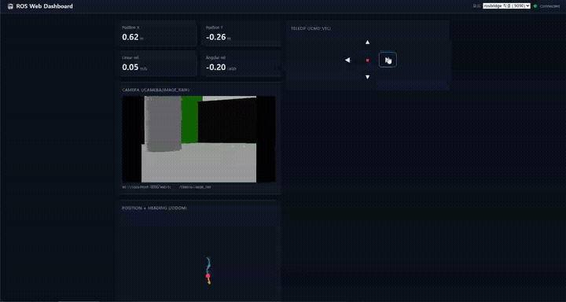
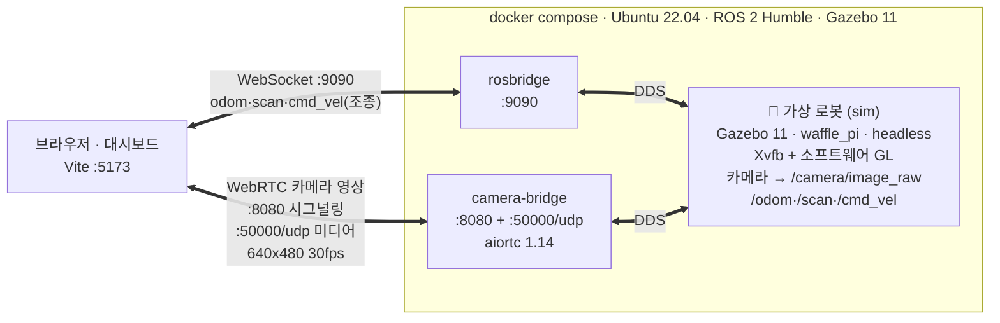

# ROS Web Dashboard

ROS(로봇)의 실시간 데이터를 브라우저에서 **모니터링**하고 **원격 제어(Teleop)** 하는 웹 대시보드.
가상 로봇(Gazebo)의 **카메라 영상은 WebRTC**로, 위치·라이다·조종은 **rosbridge**로 연결한다.("Node 18+ / Docker Desktop 필요") 



> Gazebo 가상 로봇의 카메라(WebRTC)·위치·라이다를 대시보드에서 보고, 버튼으로 조종하는 시연.
> (전부 Docker — Windows Docker Desktop 에서 브라우저 실영상까지 검증됨.)

## 주요 기능

- 📷 **카메라 영상 (WebRTC)** — 가상 로봇 카메라를 저지연 스트리밍 (aiortc 브리지, 640x480 30fps)
- 📊 **텔레메트리** — 위치(`/odom`) 수치·궤적, 라이다(`/scan`)
- 🕹 **원격 조종 (Teleop)** — 버튼으로 `/cmd_vel` 발행
- 🧩 **3가지 데이터 소스 모드** — demo(ROS 없이) / rosbridge 직결 / 백엔드 브릿지

## 시스템 구조



- **카메라 = WebRTC** (`:8080` 시그널링 + `:50000/udp` 미디어): 이미지를 JSON 으로 나르면 대역폭·지연이
  폭증하므로 aiortc 브리지가 카메라만 WebRTC 로 직접 스트리밍.
- **텔레메트리·제어 = rosbridge** (`:9090`, WebSocket+JSON): 작고 구조화된 데이터에 적합.
- **환경**: Ubuntu 22.04 · ROS 2 Humble · Gazebo 11 · aiortc 1.14 · React 18 / Vite 5.
- 📖 **전체 아키텍처**: [ARCHITECTURE.md](ARCHITECTURE.md) · 🛠 **개발 여정·트러블슈팅**: [DEVLOG.md](DEVLOG.md)

## 빠른 시작

### 1) 대시보드만 (기본 demo 모드, ROS 불필요)

```bash
npm install
npm run dev        # http://localhost:5173
```

기본으로 **demo 데이터**가 켜져 있어 ROS 없이도 대시보드가 움직입니다(가짜 `/odom`). UI 확인용.

### 2) 카메라 + 조종 전체 스택 (Docker)

```bash
docker compose -f docker-compose.camera.yml up --build
# sim(Gazebo waffle_pi) + rosbridge(:9090) + camera-bridge(:8080, :50000/udp)
```

그리고 대시보드에서 모드를 **`rosbridge 직결`** 로 바꾸면 **카메라 영상 + 위치/속도 + 버튼 조종**이 동작합니다.
(Windows Docker Desktop WebRTC 미디어 뚫기·회색 프레임 해결 등 상세는 [ARCHITECTURE.md §7](ARCHITECTURE.md).)

### 3) 텔레메트리만 (가짜 로봇, 카메라 없이)

```bash
docker compose up --build      # rosbridge(:9090) + fake_robot
```

## 스택

| 계층 | 기술 | 비고 |
|------|------|------|
| 프론트 | **React + Vite** | 표준 SPA 조합 |
| ROS 연동 | **roslib (roslibjs)** | rosbridge WebSocket 클라이언트 |
| 텔레메트리 서버 | **rosbridge_suite** | ROS1/2 공식, JSON over WebSocket |
| 카메라 | **aiortc (WebRTC 브리지)** | `/camera/image_raw` → WebRTC 스트리밍 |
| 시뮬 | **Gazebo 11 · TurtleBot3 waffle_pi** | headless(Xvfb+SW GL) |

> ROS 1 을 쓴다면 `src/ros/topics.js` 의 messageType 에서 `/msg/` 를 빼세요.
> 예: `nav_msgs/msg/Odometry` → `nav_msgs/Odometry`

## 소스 구조

```
src/
├─ ros/
│  ├─ useRos.js       # 연결 관리(자동 재연결) + subscribe/advertise + 3모드
│  ├─ topics.js       # 구독/발행 토픽 정의(/odom /cmd_vel /scan /camera)
│  └─ webrtcRos.js    # 카메라 WebRTC 브리지 클라이언트
├─ components/
│  ├─ ConnectionBar · OdomStats · PoseCanvas · Teleop
│  └─ CameraView      # 카메라 패널(demo=웹캠 / rosbridge=WebRTC)
└─ App.jsx
camera-bridge/        # aiortc 브리지 + Gazebo sim + rosbridge Dockerfile (§7)
docker-compose.camera.yml
```

## 확장 아이디어

- 백엔드에서 데이터 취합 정리
- 시뮬레이션이 현실의 진짜 모터와 달라서 실제로는 변수가 많음 (동역학이 없음)
- webRTC udp 실제 동작이 확인되지 않음(turn/sturn 서버 구성). 지금은 로컬에서의 도커 구성

- 아래는 ai 작성
- 다중 로봇: 네임스페이스(`/robot1/odom`)별 위젯
- `/scan` LaserScan 시각화(장애물), 웹 3D 뷰(three.js)
- 목적지 클릭 → Nav2 goal 전송(액션 통신)
- 메시지 rate/지연 표시, 재연결 UX
</content>
